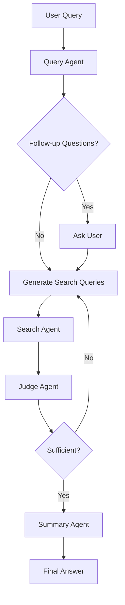

# L-MARS - Legal Multi-Agent Workflow for Orchestrated Reasoning and Agentic Search

A modern legal research system using LangGraph with structured output and multi-agent workflow.

## Overview

L-MARS implements a sophisticated multi-agent workflow for legal research inspired by OpenAI's DeepResearch, specifically tailored for legal domain research. The system uses structured output (Pydantic models) for reliable agent communication and LangGraph for orchestrated reasoning and agentic search.

## Architecture

The system consists of four specialized agents working together:

### 🤖 Agents

1. **Query Agent** - Analyzes user queries and generates clarifying follow-up questions
2. **Search Agent** - Executes searches using multiple legal tools (Serper, CourtListener)  
3. **Judge Agent** - Evaluates if search results sufficiently answer the user's question
4. **Summary Agent** - Creates comprehensive final answers with legal disclaimers

### 🔄 Workflow



### 🛠️ Tools

- **Serper Search**: Web search for general legal information
- **CourtListener**: Legal case database search
- **Contract Generation**: Contract-related queries (extensible)

## Features

✅ **Structured Output**: All agent communications use Pydantic models  
✅ **Follow-up Questions**: Like DeepResearch, asks clarifying questions first  
✅ **Iterative Refinement**: Judge agent ensures quality before final answer  
✅ **Legal Disclaimers**: Automatic inclusion of appropriate legal disclaimers  
✅ **Tool Integration**: Seamless integration with existing legal search tools  
✅ **State Management**: LangGraph handles complex workflow state  

## Installation

```bash
pip install -e .
```

Required environment variables:
```bash
export OPENAI_API_KEY="your_openai_key"
export SERPER_API_KEY="your_serper_key" 
export COURTLISTENER_API_TOKEN="your_courtlistener_token"  # optional
```

## Usage

### Basic Usage

```python
from lmars import create_legal_mind_graph

# Create the system
lmars = create_legal_mind_graph("openai:gpt-4o")

# Ask a legal question
result = lmars.invoke("Can F1 students work remotely for US companies?")
```

### Interactive Mode

```python
# Stream the workflow to see each step
for event in lmars.stream("Your legal question", config):
    step = event.get("current_step", "")
    if step == "follow_up_questions":
        # Handle follow-up questions
        questions = event.get("follow_up_questions", [])
        # ... collect user responses
        lmars.continue_conversation(responses, config)
```

### Example Scripts

- `example_usage.py` - Interactive demo and usage examples
- `test_multiagent.py` - System testing and validation

## Structured Output Models

All agents communicate using well-defined Pydantic models:

```python
class FollowUpQuestion(BaseModel):
    question: str = Field(description="The clarifying question")
    reason: str = Field(description="Why this helps")

class QueryGeneration(BaseModel):
    query: str = Field(description="Specific search query")
    query_type: Literal["case_law", "web_search", "contract"]
    priority: Literal["high", "medium", "low"]

class FinalAnswer(BaseModel):
    answer: str = Field(description="Comprehensive legal answer")
    key_points: List[str] = Field(description="Key legal points")
    sources: List[str] = Field(description="Information sources")
    confidence: float = Field(description="Confidence score", ge=0, le=1)
    disclaimers: List[str] = Field(description="Legal disclaimers")
```

## Configuration

The system supports different LLM providers:

```python
# OpenAI (default)
lmars = create_legal_mind_graph("openai:gpt-4o")

# Anthropic
lmars = create_legal_mind_graph("anthropic:claude-3-5-sonnet-latest")

# Other providers supported by langchain
lmars = create_legal_mind_graph("your_preferred_model")
```

## Dependencies

- `langgraph>=0.0.40` - Workflow orchestration
- `langchain>=0.1.0` - LLM integration  
- `pydantic>=2.0.0` - Structured output models
- `openai>=1.0.0` - OpenAI API access
- `requests>=2.28.0` - HTTP requests for tools

## Development

Run tests:
```bash
python test_multiagent.py
```

Interactive demo:
```bash
python example_usage.py
```

## License

MIT License - see LICENSE file for details.

---

**⚖️ Legal Disclaimer**: This system provides information for educational purposes only and does not constitute legal advice. Always consult with qualified legal professionals for advice specific to your situation.